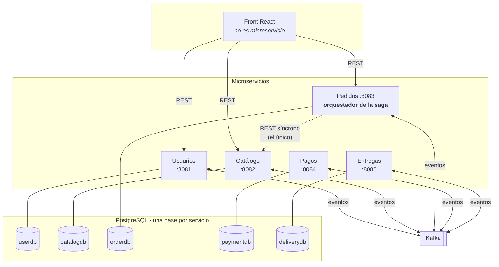
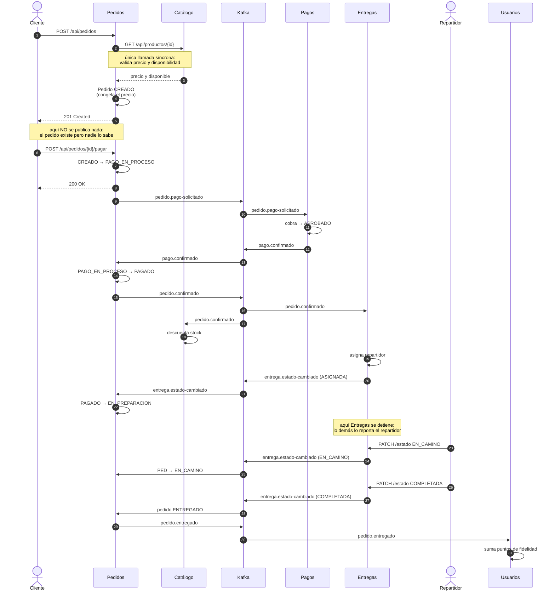
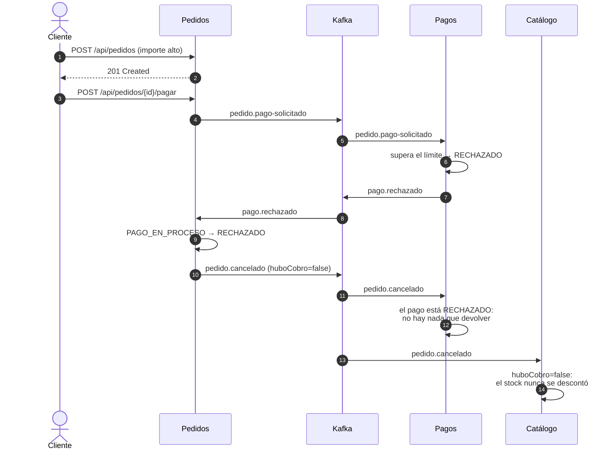

# Servicios y flujo del sistema

Qué hace cada microservicio, qué NO hace, y cómo se combinan para completar un
pedido de principio a fin.

Este documento alimenta las secciones **2.3 (diagramas)**, **3.1 (módulos y
responsabilidades)** y **3.3 (comunicación entre componentes)** del documento
de arquitectura.

---

## 1. Visión general

**Dos reglas que se leen en el diagrama:**

1. **Solo hay una flecha REST entre servicios**, la de Pedidos a Catálogo. Todo
   lo demás pasa por Kafka. Un servicio caído no arrastra a los otros.
2. **Ninguna base tiene dos flechas.** Cada servicio es el único que toca la
   suya; los demás ni siquiera pueden conectarse, porque cada base tiene su
   propio rol de Postgres sin permisos cruzados.

---

## 2. Responsabilidad de cada servicio

| Servicio | En una frase | Dueño de |
|---|---|---|
| **Usuarios** | Quién eres y qué puedes hacer | Usuario, credenciales, roles, direcciones |
| **Catálogo** | Qué se puede pedir y a qué precio | Restaurante, Producto, precio, stock |
| **Pedidos** | El ciclo de vida del pedido | Pedido, líneas, estado, total |
| **Pagos** | Cobrar y devolver dinero | Pago, transacción, reembolso |
| **Entregas** | Llevar el pedido físicamente | Entrega, repartidor, seguimiento |

### 2.1 Servicio de Usuarios · `userdb` · puerto 8081

Es el **único que emite JWT**; los demás solo verifican la firma.

| | |
|---|---|
| **Expone** | `POST /auth/registro`, `POST /auth/login`, `GET /api/usuarios/{id}` |
| **Publica** | **nada** |
| **Consume** | `pedido.entregado` → suma puntos de fidelidad (1 punto por sol) |
| **No hace** | no guarda historial de pedidos ni métodos de pago |

### 2.2 Servicio de Catálogo · `catalogdb` · puerto 8082

Es la **fuente de verdad del precio y la disponibilidad**. Nadie más puede
decidir cuánto cuesta algo.

| | |
|---|---|
| **Expone** | `GET /api/productos/{id}` ← *la única llamada síncrona del sistema*, `GET /api/restaurantes`, `GET /api/restaurantes/{id}/productos` |
| **Publica** | **nada** |
| **Consume** | `pedido.confirmado` → descuenta stock · `pedido.cancelado` → repone stock |
| **No hace** | no conoce pedidos ni calcula totales |

`disponible` no es una columna: es la regla `activo && stock > 0`.

### 2.3 Servicio de Pedidos · `orderdb` · puerto 8083 — el núcleo

**Orquestador de la saga.** Dueño de la máquina de estados y único punto que
decide si el flujo avanza.

| | |
|---|---|
| **Expone** | `POST /api/pedidos`, **`POST /api/pedidos/{id}/pagar`**, `GET /api/pedidos/{id}`, `GET /api/pedidos?clienteId=`, `POST /api/pedidos/{id}/cancelar` |
| **Publica** | `pedido.pago-solicitado`, `pedido.confirmado`, `pedido.entregado`, `pedido.cancelado` |
| **Consume** | `pago.confirmado`, `pago.rechazado`, `entrega.estado-cambiado` |
| **No hace** | no cobra tarjetas, no asigna repartidores, no decide precios |

Estados:
`CREADO → PAGO_EN_PROCESO → PAGADO → EN_PREPARACION → EN_CAMINO → ENTREGADO`,
con `CANCELADO` y `RECHAZADO` como terminales.

**Crear un pedido no lo paga.** Son dos llamadas distintas porque son dos
decisiones distintas del cliente: `POST /api/pedidos` deja el pedido en
`CREADO`, sin publicar nada y sin que ningún otro servicio se entere. La saga
arranca en `POST /api/pedidos/{id}/pagar`.

De ahí sale un dato que la máquina de estados protege sola: **el único camino a
`PAGADO` pasa por `PAGO_EN_PROCESO`**, y a ese estado solo se llega
solicitando el cobro. Nadie puede dar un pedido por pagado saltándose a Pagos.
El mismo mecanismo cubre el doble clic en el botón: el segundo intento choca
contra una transición que ya no existe y devuelve `409` sin publicar un
segundo evento.

Guarda una **copia del precio** al crear el pedido: si mañana sube, este pedido
no cambia.

### 2.4 Servicio de Pagos · `paymentdb` · puerto 8084

| | |
|---|---|
| **Expone** | `GET /api/pagos/pedido/{id}`, `POST /api/pagos/pedido/{id}/reembolso` |
| **Publica** | `pago.confirmado`, `pago.rechazado` |
| **Consume** | `pedido.pago-solicitado` → cobra · `pedido.cancelado` → reembolsa |
| **No hace** | no decide el estado del pedido, solo informa el resultado del cobro |

**No hay endpoint para cobrar.** El botón de pagar del front no llama a Pagos:
llama a Pedidos, que publica el evento. El cobro solo se dispara por evento,
así que nadie puede saltarse la saga con un `curl`.

Sin pasarela externa: la aprobación la decide una regla de dominio (importe
por encima del límite → rechazado).

### 2.5 Servicio de Entregas · `deliverydb` · puerto 8085

| | |
|---|---|
| **Expone** | `GET /api/entregas`, `GET /api/entregas/pedido/{id}`, `PATCH /api/entregas/{id}/estado` |
| **Publica** | `entrega.estado-cambiado` |
| **Consume** | `pedido.confirmado` → crea entrega y asigna repartidor |
| **No hace** | no cambia el estado del pedido, solo el de la entrega. **No avanza la entrega solo** |

Estados: `ASIGNADA → EN_CAMINO → COMPLETADA`, con `FALLIDA` como salida en
cualquier punto.

**Al consumir `pedido.confirmado`, Entregas llega hasta `ASIGNADA` y se
detiene.** De ahí en adelante avanza un actor humano —el repartidor— por
`PATCH /api/entregas/{id}/estado`. No hay temporizador ni simulador que lo haga
por él, y es deliberado: inventar un repartidor automático metería lógica
falsa en un servicio de negocio.

La consecuencia práctica es que **la saga no termina sola**: sin nadie que
reporte el avance, el pedido se queda en `EN_PREPARACION` indefinidamente. Por
eso el front incluye un panel de repartidor (`frontend/src/componentes/Repartidor.jsx`),
que es esa aplicación reducida a tres botones.

---

## 3. Cómo encajan: el camino feliz

**Lo que hay que mirar en este diagrama:** hay **dos llamadas del cliente**, no
una. Entre el `201 Created` y el `POST .../pagar` pueden pasar segundos o
minutos, y durante todo ese rato el pedido existe sin que ningún otro servicio
sepa de él. Es el equivalente al carrito confirmado pero sin pagar de cualquier
tienda.

**Lo que ocurre en cuanto se pulsa pagar:** el cliente recibe su `200` con el
pedido en `PAGO_EN_PROCESO`, no con el resultado del cobro. Eso llega
después, por evento. Si Pagos estuviera caído en ese momento, el pedido se
quedaría en `PAGO_EN_PROCESO` y el cobro se procesaría al volver el servicio —
el evento espera en Kafka.

**Y el detalle que define la orquestación:** hacia el final, Entregas no
reacciona a `pago.confirmado`; espera a `pedido.confirmado`, que publica
Pedidos. Ese salto por el medio es lo que hace de Pedidos un orquestador y no
un participante más.

---

## 4. Cuando algo sale mal: la compensación

El campo **`huboCobro`** es lo que evita que la compensación haga daño: les
dice a Pagos y a Catálogo si hay algo que deshacer o si el pedido murió antes
de tocar nada.

Los cuatro escenarios de cancelación:

| Cuándo | Estado al cancelar | `huboCobro` | Pagos | Catálogo |
|---|---|---|---|---|
| Pago rechazado | `PAGO_EN_PROCESO` | `false` | nada que reembolsar | nada que reponer |
| Cliente cancela antes de pagar | `CREADO` | `false` | nada que reembolsar | nada que reponer |
| Cliente cancela con el cobro en vuelo | `PAGO_EN_PROCESO` | `false` | tolera que no haya pago | nada que reponer |
| Cliente cancela después de pagar | `PAGADO` o posterior | `true` | **reembolsa** | **repone stock** |

`huboCobro` no es una bandera aparte que pudiera contradecir al pedido: sale
del propio estado (`EstadoPedido.implicaCobro()`), leído justo antes de la
transición a `CANCELADO`.

---

## 5. Reglas transversales

**Quién puede hablar con quién:**

| Origen | Destino | Mecanismo | Permitido |
|---|---|---|---|
| Front | cualquier servicio | REST | sí |
| Pedidos | Catálogo | REST | **sí, la única** |
| cualquier servicio | cualquier otro | REST | **no** |
| cualquier servicio | cualquier otro | eventos Kafka | sí |
| cualquier servicio | base de datos ajena | SQL | **no**, lo impide Postgres |

**Orden de los eventos.** Todos usan el **id del pedido como clave de
partición**, incluidos los que publica Pagos. Así todo lo que afecta a un
pedido cae en la misma partición y se consume en orden, aunque venga de
servicios distintos.

**Entrega al menos una vez.** Kafka puede repetir un evento, así que todo
consumidor tiene que tolerarlo:

| Servicio | Cómo lo resuelve |
|---|---|
| Pedidos | Gratis: si ya está en el estado destino, ignora |
| Pagos | Comprueba si ya existe pago para ese pedido + `UNIQUE(pedido_id)` |
| Catálogo | **Tabla `evento_procesado`**: descontar dos veces sí corrompe datos |
| Entregas | Comprueba si ya existe entrega para ese pedido + `UNIQUE(pedido_id)` |
| Usuarios | **Tabla `pedido_puntuado`**: sumar puntos dos veces corrompe el saldo |

**Fallos.** Cada consumidor reintenta 4 veces con retroceso exponencial, salvo
los errores deterministas (producto inexistente, transición imposible), que van
directos a la cola de fallidos del servicio. Todos exponen `GET /api/admin/dlq`.

---

## 6. Estado de implementación

| Servicio | Estado | Pruebas |
|---|---|---|
| Pedidos | Completo y verificado en ejecución | 45 |
| Pagos | Completo, saga verificada con Pedidos | 19 |
| Catálogo | Completo | 21 |
| Entregas | Completo | 16 |
| Usuarios | Completo | 18 |
| Front React | Construido; 4 vistas (catálogo, carrito, mis pedidos, repartidor) | — |

**Verificado en ejecución (2026-08-11):** camino feliz y compensación entre
Pedidos y Pagos, con la traza cruzando Kafka. Ver [SEGUIMIENTO.md](SEGUIMIENTO.md).

**Los cinco servicios están construidos.** El camino feliz puede recorrerse
entero hasta `ENTREGADO` y el token ya lo emite `user-service` en
`POST /auth/login`, en lugar de fabricarse a mano.

**Verificado en ejecución (2026-08-12), saga completa con los cinco servicios
arriba** — pedido `776e57a8`, S/ 42.50, desde el navegador:

| Hora | Qué pasó |
|---|---|
| `19:33:58.529` | Pedido `CREADO`, **sin publicar nada** |
| `19:34:03.919` | El cliente pulsa pagar → `PAGO_EN_PROCESO` + `pedido.pago-solicitado` |
| `19:34:04.062` | Pagos recibe el evento |
| `19:34:04.156` | Cobro aprobado (`tx-a26fdba4…`) |
| `19:34:04.205` | Pedido `PAGADO` → `pedido.confirmado` |
| `19:34:04.242` | Entregas asigna repartidor → `EN_PREPARACION` |
| `19:41:56.317` | El repartidor sale → `EN_CAMINO` |
| `19:41:59.412` | El repartidor entrega → **`ENTREGADO`**, +42 puntos de fidelidad |

Dos números que se leen ahí: **5,4 s entre crear y pagar** —el tiempo real que
tardó una persona en decidirse, que antes no existía porque el cobro era
automático— y **323 ms desde el clic hasta `EN_PREPARACION`**, que es toda la
cadena Pedidos → Pagos → Pedidos → Entregas → Pedidos cruzando Kafka cuatro
veces.

El salto de 7 minutos hasta `EN_CAMINO` no es latencia: es el tiempo que tardó
un humano en pulsar el botón del panel de repartidor.
