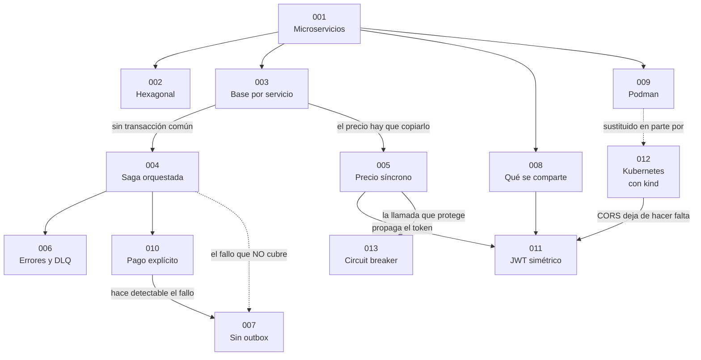

# Registro de decisiones de arquitectura (ADR)

Trece decisiones que explican por qué este sistema es como es. Cada una recoge el
problema que se quería resolver, **las alternativas que se descartaron y por
qué**, lo que se gana, lo que se paga y cómo comprobar en el repositorio que lo
que dice el documento es cierto.

Un ADR no se edita cuando la realidad cambia: se marca como sustituido y se
escribe uno nuevo. Por eso el ADR-010 dice de qué conducta anterior viene, y el
ADR-012 declara que sustituye en parte al ADR-009 — que sigue ahí, con su
razonamiento intacto, porque fue correcto para lo que evaluaba.

## Índice

| ADR | Decisión | Lo que se descartó |
|---|---|---|
| [001](ADR-001-microservicios-frente-a-monolito.md) | Cinco microservicios, uno por contexto delimitado | Monolito modular · servicios más finos |
| [002](ADR-002-arquitectura-hexagonal.md) | Hexagonal dentro de cada servicio | Capas clásicas · puertos en `application/port/out` |
| [003](ADR-003-una-base-por-servicio.md) | Un motor Postgres, una base y un rol por servicio | Base compartida · esquema por servicio · una instancia por servicio |
| [004](ADR-004-saga-orquestada.md) | Saga orquestada, con Pedidos como orquestador | Coreografía · 2PC · orquestador dedicado |
| [005](ADR-005-validacion-de-precio-sincrona.md) | El precio se pregunta a Catálogo por REST y se congela | Réplica local por eventos · confiar en el cliente |
| [006](ADR-006-errores-reintentos-dlq.md) | Reintentos, una DLQ por servicio, idempotencia focalizada | DLQ única · sin reintentos · idempotencia uniforme |
| [007](ADR-007-sin-outbox.md) | Sin outbox: ventana de inconsistencia asumida | Outbox por sondeo · CDC · transacciones de Kafka |
| [008](ADR-008-que-se-comparte.md) | Se comparte la fontanería técnica, nunca los contratos | Módulo `common` · no compartir nada · Avro y Schema Registry |
| [009](ADR-009-podman-compose.md) | Podman Compose | Kubernetes local · Docker · procesos sueltos |
| [010](ADR-010-pago-explicito.md) | Crear y pagar son dos pasos distintos | Dejarlo automático · conservar el topic antiguo |
| [011](ADR-011-jwt-clave-simetrica.md) | JWT HS256 con clave simétrica compartida | RS256 con JWKS · sesiones en Redis · validación centralizada · pasarela |
| [012](ADR-012-kubernetes-con-kind.md) | Kubernetes con kind, **además** de compose · *sustituye parcialmente al 009* | Quedarse solo en compose · migrar del todo · Helm |
| [013](ADR-013-circuit-breaker.md) | Circuit breaker solo en la llamada síncrona | En los cinco servicios · solo timeouts · respaldo con caché |

## Cómo se relacionan

Las tres flechas que más explican el sistema:

- **003 → 004**: separar las bases quita la transacción, y sin transacción hace
  falta una saga. Toda la complejidad de la compensación nace ahí.
- **004 ⇢ 007**: la DLQ cubre lo que falla al **consumir** un evento; no cubre
  el evento que nunca llegó a publicarse. Son dos problemas distintos y es el
  error más fácil de cometer al leerlos.
- **010 → 007**: separar el pago no se hizo por esto, pero como efecto
  secundario convirtió un fallo silencioso en uno detectable.

## Decisiones que no llegaron a ADR

Cerradas y registradas en [SEGUIMIENTO.md](../SEGUIMIENTO.md), pero sin ADR
propio por ser elecciones de herramienta sin alternativa arquitectónica de peso:
Kafka con Zookeeper en vez de KRaft, springdoc para la documentación de API,
Flyway para el esquema, el conjunto de observabilidad (Prometheus, Zipkin, Loki,
Grafana), Java 21 con Spring Boot 3.5.6 y la organización de paquetes heredada
del proyecto de Módulo 3.

## Documentos relacionados

| Documento | Qué contiene |
|---|---|
| [SERVICIOS_Y_FLUJO.md](../SERVICIOS_Y_FLUJO.md) | Qué hace cada servicio, qué **no** hace, y los diagramas del flujo completo |
| [MAPA_CODIGO.md](../MAPA_CODIGO.md) | De cada concepto al archivo exacto que lo implementa |
| [SEGUIMIENTO.md](../SEGUIMIENTO.md) | Decisiones cerradas, checklist de entregables, evidencias y bitácora |
